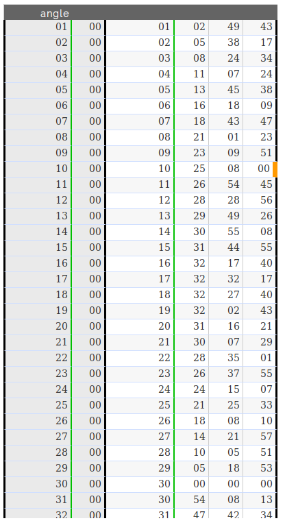
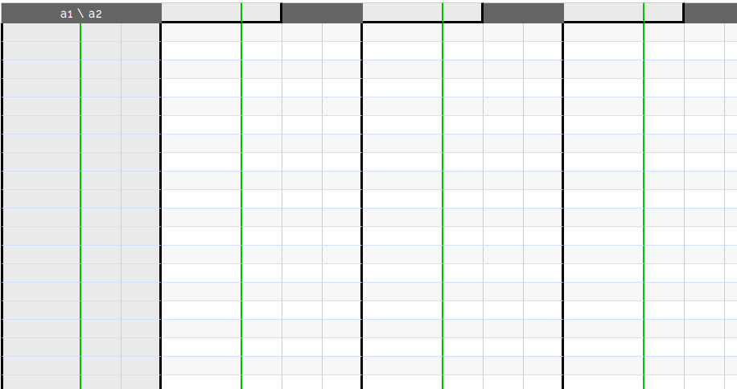
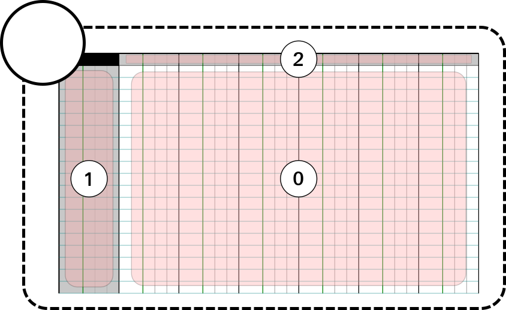
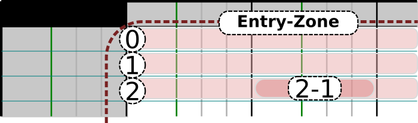
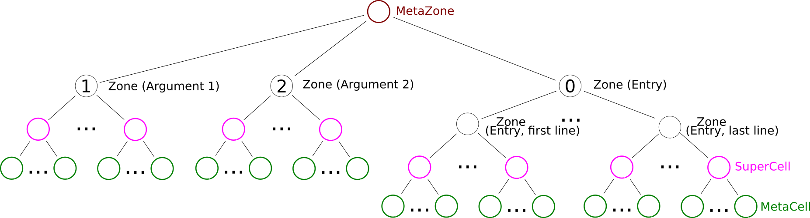
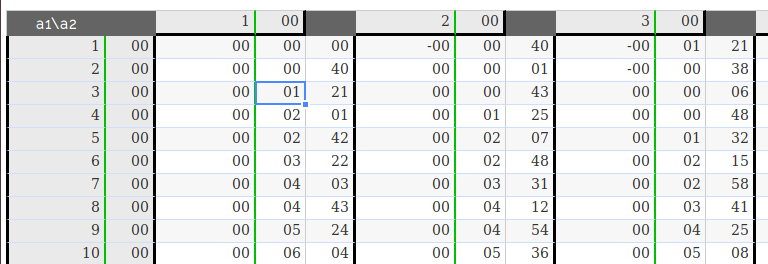

Layout
******

.. |br| raw:: html

	 

.. |div| raw:: html

	

.. |ssss| raw:: html
	
	&nbsp;&nbsp;&nbsp;&nbsp;&nbsp;&nbsp;&nbsp;&nbsp;

.. |div_row| raw:: html

	

.. |end_div| raw:: html

	

To implement a certain Layout, one must create a \ :js:class:`MetaZone`\  and fill it
with several \ :js:class:`Zone`\ s (similar to \ :js:attr:`ExampleZone`\ ).
Each of these \ :js:class:`Zone`\ s can then be composed of several \ :js:class:`SuperCell`\ s or other sub-\ :js:class:`Zone`\ s.
A \ :js:class:`Zone`\  containing \ :js:class:`SuperCell`\ s **MUST** additionally implement a `nextArg` method.

.. js:autofunction:: nextArg_example

The Layout \ :js:class:`MetaZone`\  take in input a specification of the table template.

.. js:autoattribute:: spec_example

.. js:autoclass:: Table1ArgZone

.. centered::
	|example_table| |br|
	`Example: Standard 1-argument Layout` -- This \ :js:class:`MetaZone`\  is divided into 2 sub-zones. One for the argument (angle) and one for the entry.\ |br|\  Each of this sub-zones is then divided into several \ :js:class:`SuperCell`\ s, which are composed of several \ :js:class:`MetaCell`\ s.

.. |one_tree_image| image:: 1arg_metazone_tree.png
	:width: 490pt
	:height: 178pt

.. centered::
	|one_tree_image| |br| |br|
	`Zone tree corresponding to the 1-argument layout`

.. js:autoclass:: Table2ArgZone

|div_row|  |ssss| |example_table_2| |ssss| |ssss| |div| |example_table_2_zone| |br| |example_table_2_entry| |end_div| |end_div| |br|

.. centered::
	`Example: Standard 2-argument Layout` -- This \ :js:class:`MetaZone`\  is divided into 3 sub-zones. Two for the arguments and one for the entry.\ |br|\  Each of the argument sub-zones are then divided into several \ :js:class:`SuperCell`\ s.\ |br|\ The entry sub-zone is divided in several "line"-\ :js:class:`Zone`\ , each of them divided into \ :js:class:`SuperCell`\ s.

.. centered::
	|two_tree_image| |br| |br|
	`Zone tree corresponding to the 2-argument layout`

.. centered::
	|coordinates_image| |br| |br|
	Exemple of coordinates. The selected cell has:
	|br|- \ :js:class:`CartesianCoordinates`\  : table.selectedMetaZone.grid[3][3]
	|br|- Path coordinates (i.e. zones coordinates): table.selectedMetaZone.zones[0].zones[2].zones[0].zones[1] == (entry, line #2, superCell #0, cell #1)
