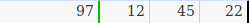
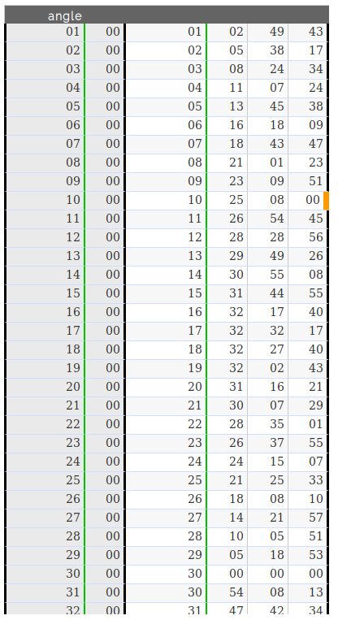
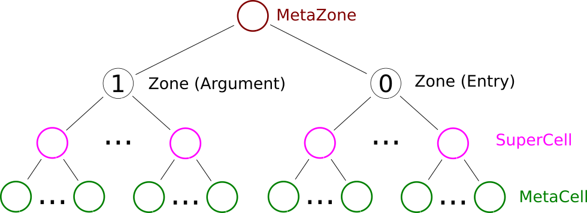

Meta-Zone
*********

.. |br| raw:: html

	 

This module extends the \ :js:class:`Zone`\ concept to correspond to our needs in DISHAS.
More specificaly, we will introduce the conecpt of \ :js:class:`SuperCell`\ s, that will represent a historical value.
\ :js:class:`SuperCell`\ s are nothing more than a group of  \ :js:class:`Cell`\ s, each of them holding the value of one radix position of the number.

.. centered::
	|example_integer_sexagesimal| |br|
	`Example` -- A SuperCell, composed of 4 Cells, representing the integer and sexagesimal number: :math:`97\enskip \boldsymbol; 12, 45, 22`

.. |example_historical| image:: example_historical.png
	:width: 300pt
	:height: 19pt

.. centered::
	|example_historical| |br|
	`Example` -- A SuperCell, composed of 6 Cells, representing the number (in historical numeral system): :math:`127\mathrm{r}\enskip 11\mathrm{s}\enskip 29\enskip \boldsymbol; 23, 59, 14`

.. note:: A \ :js:class:`SuperCell`\  knows the numeral system it is using thanks to its \ :js:attr:`spec`\  attribute.

.. centered::
	|example_table| |br|
	`Example: A Sine table` -- This \ :js:class:`MetaZone`\  is divided into 2 sub-zones. One for the argument (angle) and one for the entry.\ |br|\  Each of this sub-zones is then divided into several \ :js:class:`SuperCell`\ s, which are composed of several \ :js:class:`MetaCell`\ s.

.. centered::
	|inheritance_image| |br| |br|
	`Inheritance scheme for MetaZone classes`

.. centered::
	|tree_image| |br| |br|
	`Typical zone tree for astronomical tables`

MetaZone
========

.. js:autoclass:: MetaZone
	:members: cssGrid, auto_computations, auto_tools, horizontal_auto_tools, history, redo_list, transforming_linked, setup, gridXYCSS, applyCSS, asDecimalJSON, asOriginalJSON, fromOriginalJSON, get_all_SuperCells, selectionToMetaCells, selectionToSuperCells, lineSelect, columnSelect, superSelect, moveSelectionsHorizontally, moveSelectionsVertically, moveSelectionsNextSuperCell, isSelectionSuperSelect, validateAll, undo, redo, undoStep, redoStep, fillStarsIfEmpty, hasEmptyCells, hasUnvalidatedCells, asFunctionSuperCells, asFunction, *

MetaCell
========

.. js:autoclass:: MetaCell
	:members: val, spec, props, radix, ndigit, filler, fill, value, erase, setProp, appendProp, validate, addZeros, addStars, fillStars, fillStarsIfEmpty, isArgument, isEntry, isInfo, isFirst, isDec, isLast, nextArg, log, *

SuperCell
=========

.. js:autoclass:: SuperCell
	:members: props, spec, positions, linkedSuperCells, setSmartNumber, getSmartNumber, erase, setProp, appendProp, validateNonEmpty, fillStarsIfEmpty, isArgument, isEntry, isInfo, nextArg, nextNArgs, log, isComplete, testAtLeastOneProp, testFullProp, linkSuperCell, transformLinkedSuperCells, copyPropsToLinkedSuperCells, *
