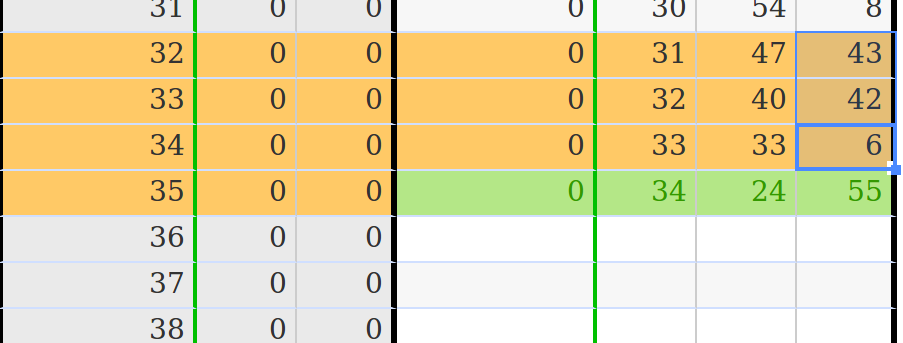

Tools for historical numbers
****************************

.. |br| raw:: html

	 

In order to ease the input of a table in the interface, we propose tools to predict some values in a table, based on others.

Examples include linear interpolation or model prediction.

SuperArea
=========

Each prediction tool uses 2 type of values:

- Source \ :js:class:`SuperCell`\ s: These are the values used to evaluate the parameters of a model (e.g. the slope and offset for a linear interpolation)
- Target \ :js:class:`SuperCell`\ s: These are the \ :js:class:`SuperCell`\ s where the result of the prediction will be put

.. centered::
	|lpp| |br|
	`Example of a forward parabolic interpolation` -- The orange \ :js:class:`SuperCell`\ s are used for estimating the parameters of the parabole, and the result is put in the green \ :js:class:`SuperCell`\ .

.. js:autoclass:: SuperArea
	:members: sourceArea, targetArea, sourceList, targetList, options, alteredCells, getSmartNumberSource, setSmartNumberTarget, eraseTarget, viewArea, cleanView, checkSourceArea, checkTargetArea, setPropSource, appendPropSource, setPropTarget, *

.. warning::
	Even if a \ :js:class:`SuperArea`\  could have several target \ :js:class:`SuperCell`\ s, we only deal with single-target
	\ :js:class:`SuperArea`\ s.
	Thus if you want to describe a computation having several target values (like filling the table with a model), it is suggested to describe it as a list of \ :js:class:`SuperArea`\ s.

InputTool
=========

The location of the source and target \ :js:class:`SuperCell`\ s of a computation are determined from the current selection in the table, and optionnaly from values in the table. Thus, an \ :js:class:`InputTool`\  is parametrized by an \ :js:func:`AreaGenerator`\  (i.e. a function able to generate source and target \ :js:class:`SuperCell`\ s from a selection) and by the \ :js:func:`MathFunction`\  to be applied.

.. js:autoclass:: InputTool
	:members: activateTool, activateToolFromArea, previewTool, cleanPreview, *

Tools
=====

In this section we describe the principal mathematical tools developed for the input interface.

.. js:autoattribute:: ForwardLinearInterpolation
.. js:autoattribute:: BackwardLinearInterpolation

.. js:autoattribute:: HorizontalLinearInterpolation
.. js:autoattribute:: BackwardHorizontalLinearInterpolation

.. js:autoattribute:: BetweenArgument
.. js:autoattribute:: BetweenLinearInterpolation

.. js:autoattribute:: Diff11Arg
.. js:autoattribute:: Diff12Arg
.. js:autoattribute:: Diff12ArgHorizontal

.. js:autoattribute:: Diff21Arg
.. js:autoattribute:: Diff22Arg
.. js:autoattribute:: Diff22ArgHorizontal

.. js:autoattribute:: Diff1_classic
.. js:autoattribute:: Diff1_reverse

.. js:autoattribute:: Diff1_vertical_classic
.. js:autoattribute:: Diff1_vertical_reverse
.. js:autoattribute:: Diff1_horizontal_classic
.. js:autoattribute:: Diff1_horizontal_reverse

.. note:: Additionally, one tool is created for every model instancied from a table type (see \ :js:class:`ParametricFunction`\  objects)

Area generators and mathematical functions
==========================================

.. js:autofunction:: AreaGenerator
.. js:autofunction:: MathFunction

Below is a list of the area generators and mathematical functions used by the previously described tools

.. js:autofunction:: ForwardInterpolation_AreaGenerator
.. js:autofunction:: BackwardInterpolation_AreaGenerator
.. js:autofunction:: VerticalInterpolation_AreaGenerator

.. js:autofunction:: HorizontalForwardInterpolation_AreaGenerator
.. js:autofunction:: HorizontalBackwardInterpolation_AreaGenerator
.. js:autofunction:: HorizontalInterpolation_AreaGenerator

.. js:autofunction:: Between_AreaGenerator
.. js:autofunction:: ForwardInterpolation_builtin

.. js:autofunction:: BetweenArgument_AreaGenerator
.. js:autofunction:: StepInterpolation_builtin

.. js:autofunction:: Diff12Arg_AreaGenerator
.. js:autofunction:: Diff12Arg_Horizontal_AreaGenerator
.. js:autofunction:: Diff11Arg_AreaGenerator
.. js:autofunction:: Diff1_builtin

.. js:autofunction:: Diff22Arg_AreaGenerator
.. js:autofunction:: Diff22Arg_Horizontal_AreaGenerator
.. js:autofunction:: Diff21Arg_AreaGenerator
.. js:autofunction:: Diff2_builtin

.. js:autofunction:: Diff1_classic_AreaGenerator
.. js:autofunction:: Diff1_reverse_AreaGenerator
.. js:autofunction:: Diff1_vertical_classic_AreaGenerator
.. js:autofunction:: Diff1_vertical_reverse_AreaGenerator
.. js:autofunction:: Diff1_horizontal_classic_AreaGenerator
.. js:autofunction:: Diff1_horizontal_reverse_AreaGenerator

.. js:autofunction:: Fill_1Arg
.. js:autofunction:: Fill_2Arg
