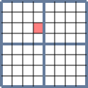
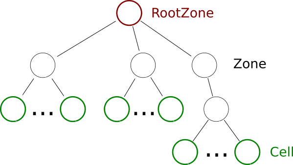

Zone module
***********

This module allows to describe a table as a hierarchy of \ :js:class:`Zone`\ s and sub-\ :js:class:`Zone`\ s, in order to separate layout and mathematical meaning for a \ :js:class:`Cell`\ . The goal is to describe a table as an entry \ :js:class:`Zone`\ , one or two argument \ :js:class:`Zone`\ s and sub-\ :js:class:`Zone`\ s corresponding to the historical numbers.

.. |br| raw:: html

	 

.. centered::
	|quadrant| |br|
	`Example:` A zone divided in four quadrant, each of them containing 4x4 Cells

.. js:autoAttribute:: ExampleZone

We introduce a class \ :js:class:`RootZone`\  for representing the root \ :js:class:`Zone`\  containing the others, and a class \ :js:class:`Cell`\ , representing the leaf zones of the "\ :js:class:`Zone`\  tree".

.. centered::
	|inheritance_image| |br| |br|
	`Inheritance scheme for zone classes`

.. centered::
	|tree_image| |br| |br|
	`Typical zone tree`

Cartesian Coordinates
=====================

.. js:autoclass:: CartesianCoordinates
	:members: *

Zone Coordinates
================

.. js:autoclass:: ZoneCoordinates
	:members: *

Zone
====

.. js:autoclass:: Zone
	:members: infos, R, C, zones, zones_positions, addZone, getLeaf, getZone, fromPath, hasInside, *
	:exclude-members: destroy

Main Zone
=========

.. js:autoclass:: RootZone
	:members: data, grid, superGrid, *
	:exclude-members: destroy

Cell
====

.. js:autoclass:: Cell
	:members: val, row, col, zoneCoordinates, addZone, getLeaf, getZone, hasInside, *
	:exclude-members: destroy
